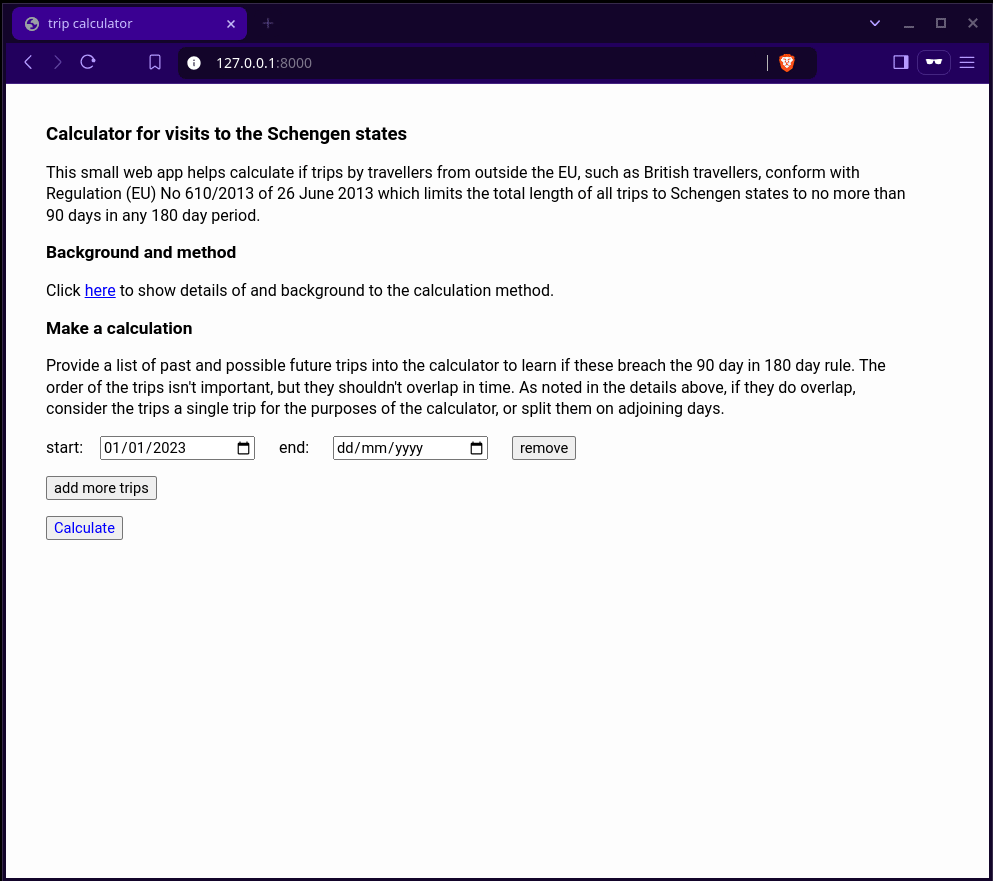

# timeaway

version 0.4.1 : 22 August 2023

A small web app to calculate if the compound length of trips to Schengen
countries by non-EU visitors conform with Regulation (EU) No 610/2013
limiting the total length of stays to no more than 90 days in any 180
day window.

The `trips` go module provides the means for calculation.

The provided web app provides a convenient interface for making
calculations at the `/home` endpoint. This endpoint can also receive
pairs of Start and End parameters for each trip, and sets the url
parameters each time a calculation is made, allowing calculations to be
conveniently saved or bookmarked.

The calculation method uses a 180 day moving window to calculate the
longest compound trip length (`windowDaysAway`). Where more than one
window has the same `windowDaysAway` the window with the earliest start
date is reported.

The `/trips` POST endpoint can be interacted with over json. This command:

```
# curl -s -X POST -d '
    [{"Start":"2022-12-01","End":"2022-12-02"},
     {"Start":"2023-01-02","End":"2023-03-30"},
     {"Start":"2023-04-01","End":"2023-04-02"},
     {"Start":"2023-09-03","End":"2023-09-12"}
    ]' 127.0.0.:8080/trips | jq .
```

gives the following output, assuming the server is running on `127.0.0.1:8080/`:

```json
{
  "error": "",
  "breach": true,
  "windowStart": "2022-12-01T00:00:00Z",
  "windowEnd": "2023-05-29T00:00:00Z",
  "windowDaysAway": 92,
  "partialTrips": [
    {"Start": "2022-12-01T00:00:00Z", "End": "2022-12-02T00:00:00Z", "Duration": 2},
    {"Start": "2023-01-02T00:00:00Z", "End": "2023-03-30T00:00:00Z", "Duration": 88},
    {"Start": "2023-04-01T00:00:00Z", "End": "2023-04-02T00:00:00Z", "Duration": 2}
  ],
  "holidays": [
    {"Start": "2022-12-01T00:00:00Z", "End": "2022-12-02T00:00:00Z", "Duration": 2},
    {"Start": "2023-01-02T00:00:00Z", "End": "2023-03-30T00:00:00Z", "Duration": 88},
    {"Start": "2023-04-01T00:00:00Z", "End": "2023-04-02T00:00:00Z", "Duration": 2},
    {"Start": "2023-09-03T00:00:00Z", "End": "2023-09-12T00:00:00Z", "Duration": 10}
  ]
}

```

## Example



## License

This project is licensed under the [MIT Licence](LICENCE).
