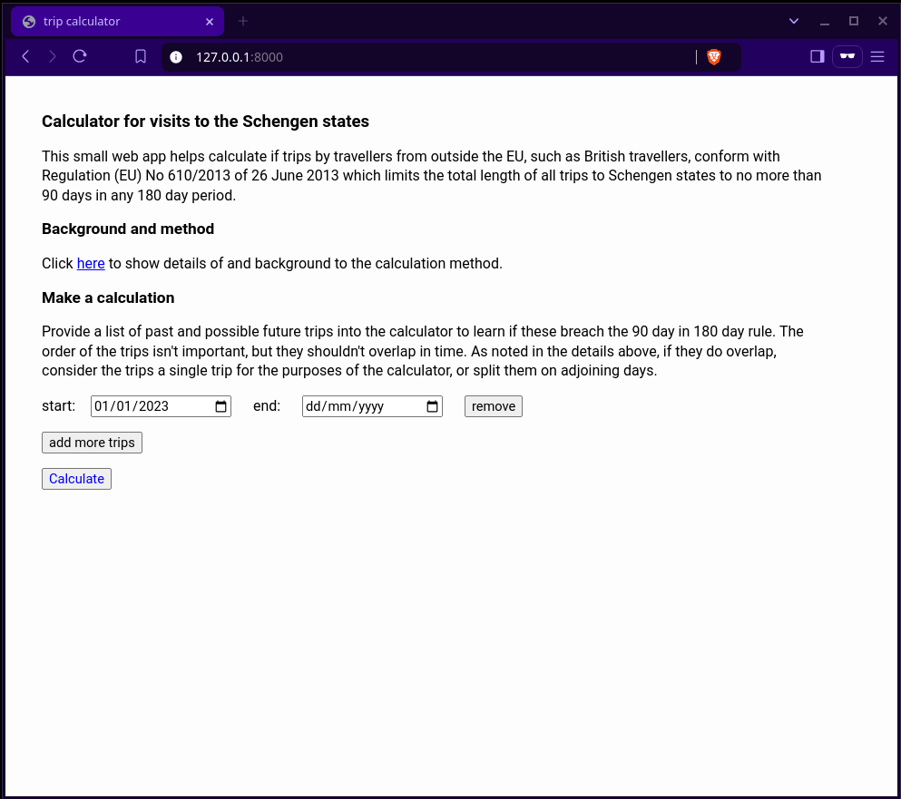

# timeaway

version v0.7.9 : 24 August 2026 (update for go 1.26)

A small web app to calculate if the compound length of trips to Schengen
countries by non-EU visitors conform with Regulation (EU) No 610/2013
limiting the total length of stays to no more than 90 days in any 180
day window. (Note that visits to the two [non-Shengen EU
countries](https://en.wikipedia.org/wiki/Schengen_Area), Ireland and
Cyprus, should _not_ be counted towards the 90 day limit.)

See the [example gif](#example). Trips are conveniently recorded in the
url for bookmarking.

You can find out more about the 90 in 180 day rule on the [GOV.UK
Travelling to the EU and Schengen area web
page](https://www.gov.uk/travel-to-eu-schengen-area), and refer to the
[official EU short-stay calculator](https://home-affairs.ec.europa.eu/policies/schengen/border-crossing/short-stay-calculator_en).

## Example



## Calculation

The [`trips`](trips/README.md) go module provides the means for
calculation.

The calculation method uses a 180 day moving window to calculate the
longest compound trip length (`daysAway`). Where more than one window
has the same `daysAway` the window with the earliest start date is
reported.

## API

The `/trips` POST endpoint can be interacted with over json. This command:

```
curl -s -X POST -d '
[{"Start":"2022-12-01","End":"2022-12-02"},
 {"Start":"2023-01-02","End":"2023-03-30"},
 {"Start":"2023-04-01","End":"2023-04-02"},
 {"Start":"2023-09-03","End":"2023-09-12"}
]' 127.0.0.1:8000/trips | jq .
```

gives the following output, assuming the server is running on `127.0.0.1:8000/`:

```json
{
  "start": "2022-12-01T00:00:00Z",
  "end": "2023-05-29T00:00:00Z",
  "daysAway": 92,
  "overlaps": 3,
  "holidays": [
    {
      "start": "2022-12-01T00:00:00Z", "end": "2022-12-02T00:00:00Z", "duration": 2,
      "overlap": {"start": "2022-12-01T00:00:00Z", "end": "2022-12-02T00:00:00Z", "duration": 2}
    },
    {
      "start": "2023-01-02T00:00:00Z", "end": "2023-03-30T00:00:00Z", "duration": 88,
      "overlap": {"start": "2023-01-02T00:00:00Z", "end": "2023-03-30T00:00:00Z", "duration": 88}
    },
    {
      "start": "2023-04-01T00:00:00Z", "end": "2023-04-02T00:00:00Z", "duration": 2,
      "overlap": {"start": "2023-04-01T00:00:00Z", "end": "2023-04-02T00:00:00Z", "duration": 2}
    },
    {
      "start": "2023-09-03T00:00:00Z", "end": "2023-09-12T00:00:00Z", "duration": 10
    }
  ],
  "error": null,
  "breach": true
}
```
Note that the last holiday has no overlap with the longest window of
`2022-12-01` to `2023-05-29`.

## Licence

This project is licensed under the [MIT Licence](LICENCE).
